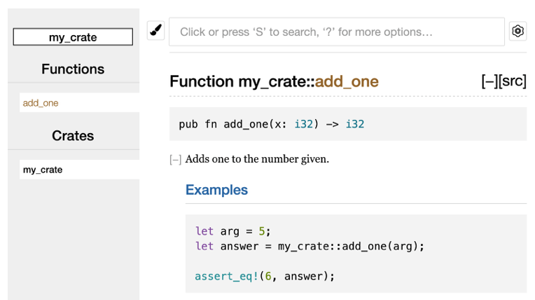
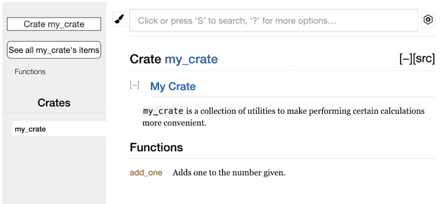

# Publishing a Crate to Crates.io

## Making Useful Comments

Rust has a documentation comment that generates HTML: `///` - three slashes.
These support markdown for formatting text.

e.g.
```rust
/// Adds one to the number given.
///
/// # Examples
///
/// ```
/// let arg = 5;
/// let answer = my_crate::add_one(arg);
///
/// assert_eq!(6, answer);
/// ```
pub fn add_one(x: i32) -> i32 {
    x + 1
}
```

You can then generate the documentation for this comment by running `cargo doc`.
The generated HTML is placed in the `target/doc` directory.

Running `cargo doc --open` will build the HTML for your current crate, as well as the docs for all your crates dependencies.

This looks like this:


## Commonly Used Sections

- Examples
- Panics: The scenarios in which the function could panic.
- Errors: If the function returns `Result`, what type of errors might occur under which conditions.
- Safety: If the function is `unsafe`, explain why it is unsafe and what invariants the function expects callers to uphold.

## Documentation Comments as Tests

The above example of a comment will run as a `Doc-test` when you run `cargo test`.

## Commenting Contained Items

This is often used in the root file to document the crate or module as a whole, as they refer to the enclosing scope rather than the item that follows the comments. E.g.

```rust
//! # My Crate
//!
//! `my_crate` is a collection of utilities to make performing certain
//! calculations more convenient.

/// Adds one to the number given.
// --snip--
```
This then shows on front page of `cargo doc --open`:


## Exporting a Convenient Public API with `pub use`

This allows you to rearrange the import structure of your applications for consumers while retaining the same internal application structure.

```rust
//! # Art
//!
//! A library for modeling artistic concepts.

pub use self::kinds::PrimaryColor;
pub use self::kinds::SecondaryColor;
pub use self::utils::mix;

pub mod kinds {
    // --snip-- ... contains PrimaryColor and SecondaryColor
}

pub mod utils {
    // --snip-- ... contains mix
}
```

Now `PrimaryColor`, `Secondary Color` and `mix` are easily available for your API consumers!

## Setting Up a Crates.io Account

- Visit `crates.io` and login via github.
- Go to `https://crates.io/me/` and retrieve your API key.
- Run `cargo login apikeygoeshereadslkjfasleasfdsaijd12345`

## Adding Metadata to a New Crate

Setup the name of your crate in `Cargo.toml` (it must be unique) and the license, description etc.
```go
[package]
name = "guessing_game"
version = "0.1.0"
edition = "2021"
description = "A fun game where you guess what number the computer has chosen."
license = "MIT OR Apache-2.0"

[dependencies]
```

## Publishing to Crates.io

Be careful - these changes are permanent!

`cargo publish`.

Boom, it's that simple!

## Removing Versions from Crates.io with `cargo yank`

This means people already consuming that version can continue to, but no new users will be allowed to install the yanked version.

`cargo yank --vers 1.0.1`

And to undo:

`cargo yank --vers 1.0.1 --undo`
