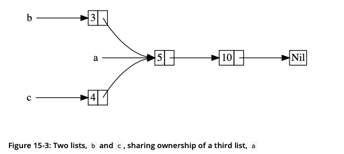

# `Rc<T>`, the Reference Counted smart Pointer

There are cases when a single value might have multiple owners e.g. a graph data structure.

To enable multiple ownership Rust has the type `Rc<T>` - this is an abbreviation for *reference counting*.
It keeps track of the number of references to a value to determine whether or not the value is still in use.
If there are 0 references left, the value can be cleaned up.

This is only needed when we cannot determine at compile time which part will finish using the data last (otherwise we could just make that part the owner).

`Rc<T>` is only for use in single-threaded scenarios.

## Using `Rc<T>` to Share Data

Lets make this data structure as an example:



```rust
enum List {
    Cons(i32, Rc<List>),
    Nil,
}

use crate::List::{Cons, Nil};
use std::rc::Rc;

fn main() {
    let a = Rc::new(Cons(5, Rc::new(Cons(10, Rc::new(Nil)))));
    let b = Cons(3, Rc::clone(&a)); // clone here only clones the reference
    let c = Cons(4, Rc::clone(&a)); // can also use a.clone() but that is not idiomatic and makes it hard to distinguish between Rc clones and expensive deep clones when doing performance optimisation
}
```

## Cloning an `Rc<T>` Increases the Reference Count

```rust
fn main() {
    let a = Rc::new(Cons(5, Rc::new(Cons(10, Rc::new(Nil)))));
    println!("count after creating a = {}", Rc::strong_count(&a));
    let b = Cons(3, Rc::clone(&a));
    println!("count after creating b = {}", Rc::strong_count(&a));
    {
        let c = Cons(4, Rc::clone(&a));
        println!("count after creating c = {}", Rc::strong_count(&a));
    }
    println!("count after c goes out of scope = {}", Rc::strong_count(&a));
}
```

Prints:

```bash
$ cargo run
   Compiling cons-list v0.1.0 (file:///projects/cons-list)
    Finished dev [unoptimized + debuginfo] target(s) in 0.45s
     Running `target/debug/cons-list`
count after creating a = 1
count after creating b = 2
count after creating c = 3
count after c goes out of scope = 2
```

Using `Rc<T>` allows a value to have multiple owners.
