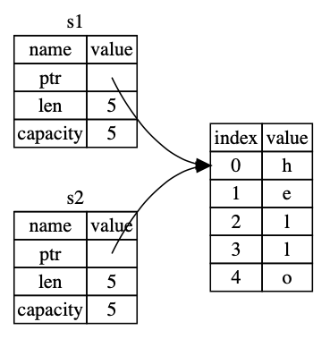

# Chapt 4 - Ownership

## Stack vs Heap

- Stack is faster but values must have a fixed size
- Heap is slower but can handle variable sizes. Uses pointers.

## Ownership Rules

- Each value in Rust has a variable that's called it's *owner*
- There can only be one owner at a time
- When the owner goes out of scope, the value will be dropped

## Variable Scope

- a variable is block scoped
```rust
{                      // s is not valid here, it’s not yet declared
    let s = "hello";   // s is valid from this point forward

    // do stuff with s
}                      // this scope is now over, and s is no longer valid
```

## The String type

Unlike a string literal, the String type is:
- Mutable
- Are allocated on the heap
- Can store an amount of text that is unknown at compile time

```rust
let mut s = String::from("hello");

s.push_str(", world!"); // push_str() appends a literal to a String

println!("{}", s); // This will print `hello, world!`
```

## Memory and Allocation

- Memory must be requested from the allocator at runtime
- Memory must be returned to the allocator when we are done with it

Rust uses the `drop` function when a variable goes out of scope at the closing curly bracket.

## Ways Variables and Data Interact: Move

- In this example as x and y are scalar values, the value of x is simply copied to be the value of y.
```rust
let x = 5;
let y = x;
```

- In this example the stack holds the pointer, length and capacity (both in bytes), and the contents is stored in the heap as in the diagram below:
```rust
let s1 = String::from("hello");
let s2 = s1;
```


- When we assign `s1` to `s2` the `String` data is copied, but the content remains the same on the heap.


- If `s2` and `s1` go out of scope, they would both try to `drop` the same memory, causing a `double free` error, corrupting memory.
- To avoid this, Rust considers `s1` no longer valid.

Hence the following code throws an error:
```rust
let s1 = String::from("hello");
let s2 = s1;

println!("{}, world!", s1);
```
Error:
```bash
$ cargo run
   Compiling ownership v0.1.0 (file:///projects/ownership)
error[E0382]: borrow of moved value: `s1`
 --> src/main.rs:5:28
  |
2 |     let s1 = String::from("hello");
  |         -- move occurs because `s1` has type `String`, which does not implement the `Copy` trait
3 |     let s2 = s1;
  |              -- value moved here
4 | 
5 |     println!("{}, world!", s1);
  |                            ^^ value borrowed here after move

For more information about this error, try `rustc --explain E0382`.
error: could not compile `ownership` due to previous error
```

- This switch from `s1` to `s2` is called a `move`, instead of a `shallow copy`, as no copy happens the value is just moved.
- This solves the problem, automatic copying in Rust is always cheap, safe and performant.

## Ways Variables and Data Interact: Clone

- If you need to `deep clone` you can use the `clone` method like so:
```rust
let s1 = String::from("hello");
let s2 = s1.clone();

println!("s1 = {}, s2 = {}", s1, s2);
```

## Stack-Only Data: Copy

- This is allowed, as data stored on the stack can be implicitly copied.
```rust
let x = 5;
let y = x;

println!("x = {}, y = {}", x, y);
```
- This is allowed for types that implements the `Copy` trait.
- You cannot annotate a type with `Copy` if the type or any of its parts has implemented the `Drop` trait.

- Types that implement the `Copy` type:
  - All integer types such as `u32`
  - The Boolean type `bool`
  - Floating point types e.g. `f64`
  - The character type `char`
  - Tuples if they contain type that also implement `Copy` e.g. `(i32, i32)`

## Ownership and Functions

- When you pass an argument into a function, stack values are copied and heap values are moved.
- Hence you cannot use a heap value that has been passed into a function unless you clone it.
```rust
fn main() {
    let s = String::from("hello");  // s comes into scope

    takes_ownership(s);             // s's value moves into the function...
                                    // ... and so is no longer valid here

    let x = 5;                      // x comes into scope

    makes_copy(x);                  // x would move into the function,
                                    // but i32 is Copy, so it's okay to still
                                    // use x afterward

} // Here, x goes out of scope, then s. But because s's value was moved, nothing
  // special happens.

fn takes_ownership(some_string: String) { // some_string comes into scope
    println!("{}", some_string);
} // Here, some_string goes out of scope and `drop` is called. The backing
  // memory is freed.

fn makes_copy(some_integer: i32) { // some_integer comes into scope
    println!("{}", some_integer);
} // Here, some_integer goes out of scope. Nothing special happens.
```

## Return Values and Scope

```rust
fn main() {
    let s1 = gives_ownership();         // gives_ownership moves its return
                                        // value into s1

    let s2 = String::from("hello");     // s2 comes into scope

    let s3 = takes_and_gives_back(s2);  // s2 is moved into
                                        // takes_and_gives_back, which also
                                        // moves its return value into s3
} // Here, s3 goes out of scope and is dropped. s2 was moved, so nothing
  // happens. s1 goes out of scope and is dropped.

fn gives_ownership() -> String {             // gives_ownership will move its
                                             // return value into the function
                                             // that calls it

    let some_string = String::from("yours"); // some_string comes into scope

    some_string                              // some_string is returned and
                                             // moves out to the calling
                                             // function
}

// This function takes a String and returns one
fn takes_and_gives_back(a_string: String) -> String { // a_string comes into
                                                      // scope

    a_string  // a_string is returned and moves out to the calling function
}
```

- This behaviour leads to the following issue:
```rust
fn main() {
    let s1 = String::from("hello");

    let (s2, len) = calculate_length(s1);

    println!("The length of '{}' is {}.", s2, len);
}

fn calculate_length(s: String) -> (String, usize) {
    let length = s.len(); // len() returns the length of a String

    (s, length)
}
```
- As the value is moved when it is passed into a function to do something simple like get its length, we have to return the original value back out of the function and move it into a new variable.
- This is ugly and a lot of ritual/ceremony just to do something simple.
- To avoid this problem we have a feature called `references`.
