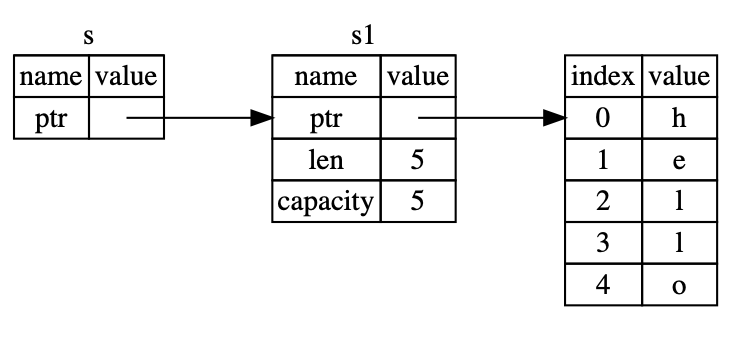

# Reference and Borrowing

To avoid the returning a tuple issue (from the end of chapt 4.1), we can use a reference.
A reference is like a pointer, accept it is guaranteed to point to a valid value of a certain type.

```rust
fn main() {
    let s1 = String::from("hello");

    let len = calculate_length(&s1); // & represents a reference

    println!("The length of '{}' is {}.", s1, len);
}

fn calculate_length(s: &String) -> usize {
    s.len()
}
```
Using a reference we can pass around values without transferring ownership of that value.

- In the following diagram, `s` is the reference.


```rust
fn calculate_length(s: &String) -> usize { // s is a reference to a String
    s.len()
} // Here, s goes out of scope. But because it does not have ownership of what
  // it refers to, nothing happens.
```
- Creating a reference is called `borrowing`.
- You can make references mutable e.g. `&mut String`

## Mutable References

- **You can have only one mutable reference to a particular piece of data at a time.**

Hence this code fails:
```rust
let mut s = String::from("hello");

let r1 = &mut s;
let r2 = &mut s;

println!("{}, {}", r1, r2);
```

This makes mutation more controlled and prevents *data races* which occur when these three behaviors occur:
- Two or more pointers access the same data at the same time
- At least one of the pointers is being used to write to the data
- There's no mechanism being used to synchronize access to the data

*Data races* cause undefined data that is hard to identify, fix and debug.
Rust fixes this by refusing to compile code with data races.

- We can have multiple mutable references, just not *simultaneous ones*:
```rust
let mut s = String::from("hello");

{
    let r1 = &mut s;
} // r1 goes out of scope here, so we can make a new reference with no problems.

let r2 = &mut s;
```

- **You can not have a mutable reference while having an immutable one for the same value.**

Hence this code fails:
```rust
let mut s = String::from("hello");

let r1 = &s; // no problem
let r2 = &s; // no problem
let r3 = &mut s; // BIG PROBLEM

println!("{}, {}, and {}", r1, r2, r3);
```

This is because users of an immutable reference don't expect the data they are reading to suddenly change.

- Note - a references scope is limited and continues until the last time it is used, hence the following code is acceptable:

```rust
let mut s = String::from("hello");

let r1 = &s; // no problem
let r2 = &s; // no problem
println!("{} and {}", r1, r2);
// variables r1 and r2 will not be used after this point

let r3 = &mut s; // no problem
println!("{}", r3);
```

- The compiler can tell that a reference is no longer being used at a point before the scope ends due to *Non-Lexical Lifetimes* or NNL for short.

## Dangling References

- A dangling pointer references a location in memory that has has been given to someone else. It is no longer valid.
- Rust guarantees there will be no dangling references.

Hence the following code won't compile:
```rust
fn main() {
    let reference_to_nothing = dangle();
}

fn dangle() -> &String {
    let s = String::from("hello");

    &s
}
```

## The Rules of References

- **At any given time, you can have either one mutable reference or many immutable references.**
- References must always be valid.


