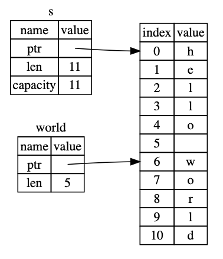

# The Slice Type

Slices reference a contiguous sequence of elements.
As slices are references, they do not have ownership.

- Imagine we are trying to get the first word from a string.
- We could start by returning the index of the first space:

```rust
fn first_word(s: &String) -> usize {
    let bytes = s.as_bytes();

    // .iter() creates an iterator, enumerate() places each element within a tuple
    // within each tuple is 1. the index, 2. reference to the element
    for (i, &item) in bytes.iter().enumerate() { 
        // b' ' is byte literal syntax i.e. the byte for 't' is 116
        // but instead of writing item == 116 we can write item == b't'
        if item == b' ' {
            return i;
        }
    }

    s.len()
}
```

- This causes a problem, what if the string is mutated after we execute this function, then the returned value is no longer valid:

```rust
fn main() {
    let mut s = String::from("hello world");

    let word = first_word(&s); // word will get the value 5

    s.clear(); // this empties the String, making it equal to ""

    // word still has the value 5 here, but there's no more string that
    // we could meaningfully use the value 5 with. word is now totally invalid!
}
```

The solution is string slices:

## String Slices

- A string slice is a reference to a part of a `String`.

```rust
let s = String::from("hello world");

let hello = &s[0..5];
let world = &s[6..11];
```

- `let world = &s[6..11];` looks like this:



- In rust syntax if you want to start at 0 you can drop the 0, hence the following are the same:

```rust
let s = String::from("hello");

let slice = &s[0..2];
let slice = &s[..2]; // this is the same as the above
```

- Similarly if the last value goes to the end of the string, you can drop it as follows:

```rust
let s = String::from("hello");

let len = s.len();

let slice = &s[3..len];
let slice = &s[3..]; // this is the same a the above
```

- You can drop both values to take a slice of the entire string:

```rust
let s = String::from("hello");

let len = s.len();

let slice = &s[0..len];
let slice = &s[..]; // this is the same as the above
```

- Note: If you are using not ASCII characters, you cannot slice in the middle of a multi-byte character.

Now we can use this to write to proper solution to our original problem:

```rust
fn first_word(s: &String) -> &str {
    let bytes = s.as_bytes();

    for (i, &item) in bytes.iter().enumerate() {
        println!("{}", &item);
        if item == b' ' {
            return &s[..i];
        }
    }

    &s[..]
}
```

- Now if we try and create the same error as before, we are saved at compile time!

```rust
fn main() {
    let mut s = String::from("hello world");

    let word = first_word(&s);

    s.clear(); // error!

    println!("the first word is: {}", word);
}
```
This throws the following error:
```bash
$ cargo run
   Compiling ownership v0.1.0 (file:///projects/ownership)
error[E0502]: cannot borrow `s` as mutable because it is also borrowed as immutable
  --> src/main.rs:18:5
   |
16 |     let word = first_word(&s);
   |                           -- immutable borrow occurs here
17 | 
18 |     s.clear(); // error!
   |     ^^^^^^^^^ mutable borrow occurs here
19 | 
20 |     println!("the first word is: {}", word);
   |                                       ---- immutable borrow later used here

For more information about this error, try `rustc --explain E0502`.
error: could not compile `ownership` due to previous error
```

- `clear()` creates a mutable reference under the hood, and you cannot have a mutable and immutable reference at the same time, so it won't compile.

- String literals e.g. `let s = "Hello world!";` are slices. `s` here is `&str`. It's a slice pointing to a specific point of the binary. This is why string literals are immutable - `&str` is an immutable reference.

## String Slices as Parameters

You can upgrade the `first_word` function by changing the type of the parameter to `&str`:
```rust
fn first_word(s: &str) -> &str {..}
```
Now we pass can type `&String` and type `&str` into the function.
Or put another way, we can pass string literals and references or slices of the `String` type into the function.

Now the function is more general and works in all of these situations:
```rust
fn main() {
    let my_string = String::from("hello world");

    // `first_word` works on slices of `String`s, whether partial or whole
    let word = first_word(&my_string[0..6]);
    let word = first_word(&my_string[..]);
    // `first_word` also works on references to `String`s, which are equivalent
    // to whole slices of `String`s
    let word = first_word(&my_string);

    let my_string_literal = "hello world";

    // `first_word` works on slices of string literals, whether partial or whole
    let word = first_word(&my_string_literal[0..6]);
    let word = first_word(&my_string_literal[..]);

    // Because string literals *are* string slices already,
    // this works too, without the slice syntax!
    let word = first_word(my_string_literal);
}
```

## Other Slices

There is a more general slice type.

Consider this array:
```rust
let a = [1, 2, 3, 4, 5];

let slice = &a[1..3];

assert_eq!(slice, &[2, 3]);
```

- `slice` has the type `&[i32]`, so it works the same way as string slices do, by storing a reference to the first element and the length. You can use this sort of slice for all sorts of other collections.

## Summary

- The concepts:
  - Ownership
  - Borrowing
  - Slices
    - Ensure memory safety in Rust at compile time.
- Rust gives you control over memory usage just like other systems languages.
  - You don't have to write and debug extra code though to get this control.
- Ownership effects how lots of other parts of rust work.

